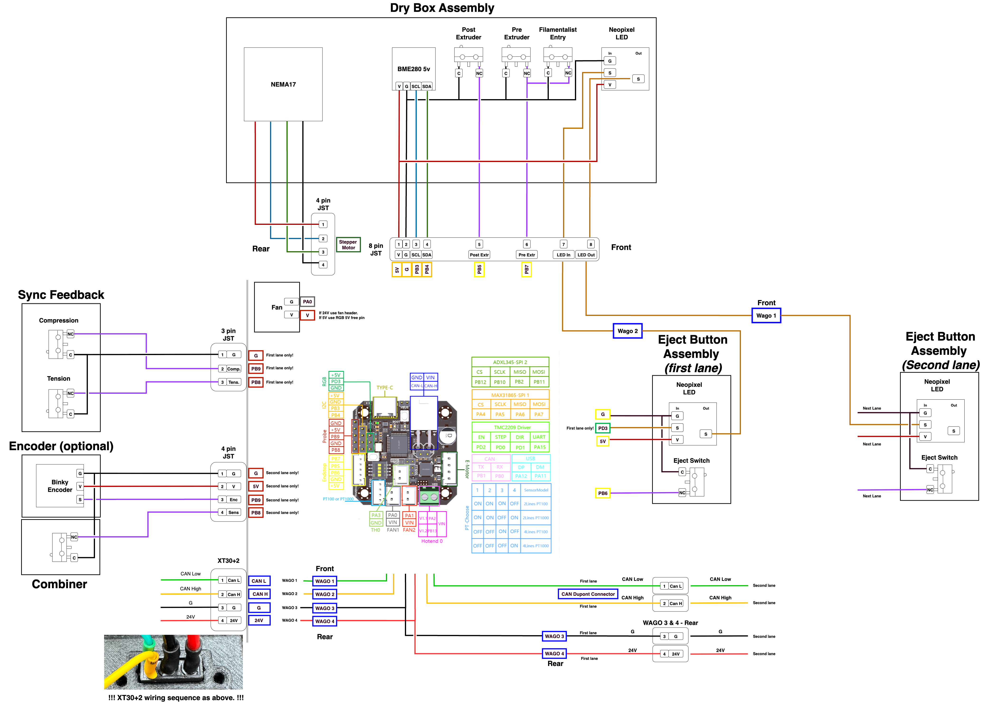

[![CC BY-NC-SA 4.0][cc-by-nc-sa-shield]][cc-by-nc-sa]

# EMU – Expandable Multi-material Unit
### A new take on a MMU by <a href="https://github.com/DW-Tas">DW-Tas</a> and <a href="https://github.com/igiannakas">igiannakas</a> 
<a href="https://ko-fi.com/O5O5OCC0K"> Ko-Fi</a>

> [!WARNING] 
> ***Under Active/Early Development***  
> Build at your own risk

**Introducing the EMU, the Expandable Multi-material Unit from down under.** The EMU is a modular, flexible, upgradable, reliable and service-friendly MMU designed around the proven filamentalist V3 platform.

The EMU supports any number of lanes and base configurations; whether it is a **single lane setup** to assist filament loading, a **dual lane configuration** for endless spool, or a **multi-lane, multi base unit setup** for multi-material printing. It is also **expandable**, with no re-printing of parts required when upgrading from a 2 lane to a multiple lane setup.

  

#### Table of Contents
- [Design Objectives & Key Features](#design-objectives)
- [BOM](#bom)
- [Assembly Videos](#assembly-videos)
- [Wiring Instructions and Diagrams](#wiring-diagrams)
- [Render Gallery](#render-gallery)
- [License](#this-work-is-licensed-under-a)

#### Highlights:
- **Modular & Expandable** design, able to add lanes anytime and in any configuration. No reprints when upgrading from a 2 lane setup.
- **One screw or tool-free** access and servicing, even mid-print.
- **Sealed dry boxes** able to maintain humidity in the 15% range (with silica gel) or 5–8% range (with molecular sieves) for weeks.  
- **Humidity** sensors per lane for environmental monitoring.
- **Reliable endless spool** with no chance of the rewound filament interfering with neighbouring rolls.
- **Off-the-shelf electronics** (EBB42 with EBB36 also fully compatible).  
- **Per-lane controls** - eject button + LEDs.

  
  

## Design Objectives

#### Modularity & Upgradeability  
Each lane is fully self-contained, so you can choose **exactly how many lanes you need and group them as you like**. You can also **mix and match** lanes across multiple base units, or use a stand-alone single lane for extruder loading and print assistance. 

Expanding later is also straightforward. Just print lane expanders for the base and add another dry box assembly. There is no need to reprint or replace existing parts when upgrading from a 2 lane base. 

#### Ease of Servicing 
All electrical and mechanical components are either **one screw or completely tool-free and immediately accessible**, making live troubleshooting possible even during a print. 

Access to the electronics is easy - just lift the dry box off its base for full access. The stepper tensioning screw is accessible without any dissassembly allowing on the fly tuning of filament grip. Finally, removing the filamentalist, stepper and stepper assembly is possible via one screw.

#### Sealed Dry Boxes  
Each spool sits in its own purpose built, **fully sealed dry box with an integrated desiccant holder**. The boxes use foam cord in areas of potential air ingress to create a tight seal, with the clear 1.5mm PETG/PC panel also offering visibility inside the dry box.

The dry boxes can maintain humidity in the 15% range (with silica gel) or 5–8% range (with molecular sieves) for weeks. Finally, as each dry box is self contained, opening one to reload filament, doesn’t disturb its neighbours, extending the effective desiccant life.

  

#### Integrated Humidity Sensors 
Each lane monitors its own environment, letting you know when it’s **time to refresh the desiccant**. The humidity sensors are integrated into Mainsail (and optionally in Home Assistant for historical data tracking via the mainsail HA integration).

#### Endless Spool Reliability
Dual pre-stepper sensors ensure **consistent run-out detection** and reliable re-wind, as the filament is always gripped by the stepper hobbed gear assembly. 

In addition, the isolated boxes ensure that any left over, rewound, filament cannot interfere with neighbouring lanes, **preventing a jam**.

#### Built on the Filamentalist
The lane assembly is based on the proven **[filamentalist V3 design with 688 bearings](https://github.com/Enraged-Rabbit-Community/ERCF_v2/tree/master/Recommended_Options/Filamentalist_Rewinder/Filamentalist_FV3_Rewinder)**, with no modifications necessary. 
- Existing 688 bearing version filamentalist parts can be reused when building an EMU.
- Optionally, the revised tensioner mount further improves pre-stepper switch actuation.
- Wide spool size compatibility - built on the 74mm filamentalist stock setup and fits even KVP filament spools.

  
  

#### Integrated Filament Driving Stepper 
Each lane has its own driving stepper inside the dry box, resulting in a compact, **fully self-contained mechanical design**. In case of mechanical issue, you can swap out filamentalist assemblies with 3 screws, unplugging 2 JST plugs and unplugging the bowden tube. 

In addition, you can **swap out complete dry boxes** by unplugging two JST plugs and the bowden tube. This is helpful if you want to maintain a particularly moisture sensitive filament undisturbed when swapping it out from the EMU.

#### Simple Electronics
The recommended BOM uses **readily available EBB42 boards** (with EBB36 fully compatible). MMB v2 boards can also be reused, though without humidity sensing due to I²C limitations and a slightly more intricate wiring.

In addition, **each lane has its own ventilation fan**, ensuring the stepper drivers do not overheat, even when the unit is placed on top of a hot printer. With the EBB42 and EBB36, the ventilation fans can also be speed controlled to minimize noise.

#### Easy mounting
The EMU base assembly can be securely **mounted on extrusions** or using **rubber feet** directly on the printer or besides it. In either case the **electronics remain accessible** without needing to remove the unit from its mounts.

#### Per-lane Controls  
Each lane includes its own eject button, status LED, and a filament colour LED that illuminates the dry box. 

## BOM  
[Draft BOM here](https://docs.google.com/spreadsheets/d/1jYJXBgpc_iLDfC17fC2LTYKrSEy5ocPbGEQ_EEOGCvI)

## Assembly Videos

**Part 1: Filamentalist and Stepper Assembly Guide** 

 

**Part 2: Drybox Assembly Guide** 

 

**Part 3: Base Assembly Guide**  

 

**Part 4: Wiring Guide**  

 

## Wiring Diagrams
Depending on the number of lanes assembled, the wiring will vary slightly. Below are some initial wiring key notes to get your started. 

**Multi-lane setup wiring notes (2+ lanes)**
1. Please note that the sync feedback sensor is connected to the first lane board. The encoder and combiner endstop is connected to the second lane EBB board.
2. The CAN bus umbilical from the printer feeds power and the CAN H / L wires to the WAGO connectors in the first lane. 
3. A 24V and Ground "bus" is established throughout the base unit using the two rearward WAGO connectors (WAGO 3 and WAGO 4).
4. The EBB boards connect to the power bus for power via their XT ports.
5. The EBB boards are daisy chained to establish the CANbus network. The first lane canbus High / Low / Power wires are connected to the first lane WAGO connectors.
7. The second lane canbus High / Low wires are connected to the CAN out dupont connectors on the first board itself. Creates the daisy chain
9. The last EBB board needs the 120Ohm resistor installed.
10. The second lane, third lane etc 2nd WAGO connector is used to connect the Neopixel Out wire from the eject button to the Neopixel In wire on the dry box.
11. The second lane, third lane etc 1st WAGO connector is used to connect the Neopixel Out wire from the dry box to the next lane Neopixel In wire on the eject button.

**Adding a second base unit**  
You can daisy chain as many base units as you desire. Simply wire the XT30+2 CAN out port next to the last lane to the power bus and CAN H / L dupont connectors on the last EBB board. The next base unit can connect using a standard CAN Bus cable to the first unit.

**Single-lane setup wiring notes (2+ lanes)**  
1. A single lane setup does not support an encoder/combiner. Instead, the Post Extruder sensor is configured in the Happy Hare configuration as the gate sensor.
2. There is no daisy chaining required. The single EBB board is connected to the first lane WAGO connectors.
3. There is no daisy chaining of subsequent lane Neopixels. 

**EBB 42 wiring diagram** 

  

**EBB 36 wiring diagram** 
Please note, the EBB36 uses identical pin definitions to the EBB42.

  

**Printer PSU** 
> [!WARNING]
> You need to evaluate whether your PSU has enough power headroom to operate the number of lanes of your choosing. This entirely depends on your printer's overall setup and how many lanes of the EMU you are planning to build.

Key factors to consider:
1. PSU wattage
2. How many A-B/X-Y and Z steppers 
3. At what current the main printer steppers are operating at 
4. Your heater cartridge wattage 
5. What other power consuming accessories are connected to the printer (cpap, heater bed if 24V etc)
6. How many EMU lanes you are planning to build

Depending on the combined power consumption, you may need to consider whether a PSU upgrade is needed. 

As a rule of thumb, a 12 lane EMU build with 4 Z steppers and 2 AB steppers running moderately high currents and high print speeds on a Voron 2.4 may require a 350Watt power supply to ensure adequate power headroom.

### Render Gallery

  
  

  
  

 

#### This work is licensed under a
[Creative Commons Attribution-NonCommercial-ShareAlike 4.0 International License][cc-by-nc-sa].

[![CC BY-NC-SA 4.0][cc-by-nc-sa-image]][cc-by-nc-sa]

[cc-by-nc-sa]: http://creativecommons.org/licenses/by-nc-sa/4.0/
[cc-by-nc-sa-image]: https://licensebuttons.net/l/by-nc-sa/4.0/88x31.png
[cc-by-nc-sa-shield]: https://img.shields.io/badge/License-CC%20BY--NC--SA%204.0-lightgrey.svg

### License clarification regarding non-commercial use:
The non-commercial aspect of this license is for cases where EMU is the product, not the use of EMU to create products. 
I.e. If you wish to sell EMU as a product, you would need to seek a commercial license before doing so.  
It is NOT intended to prevent the use of EMU with a printer that you use to provide commercial services. If you want to run EMU in your print farm, go right ahead.
